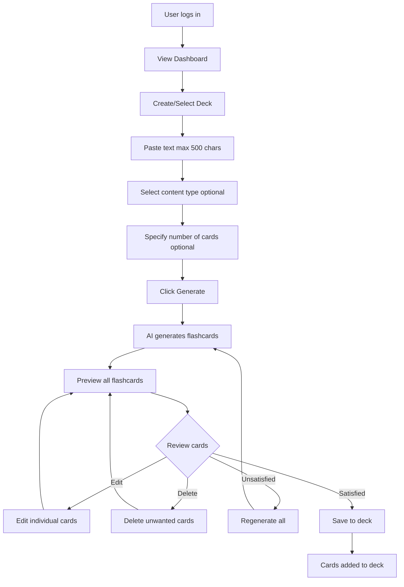
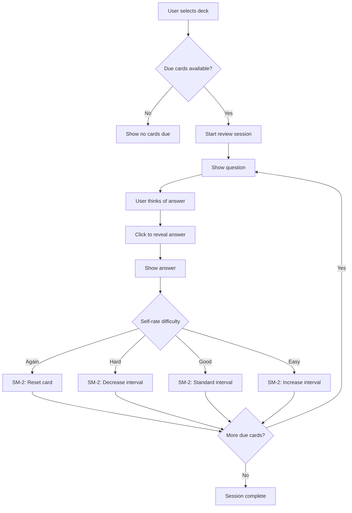
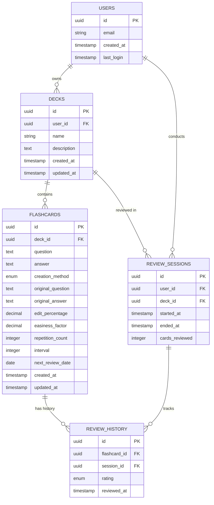

# Functional Requirements Document

## AI-Powered Flashcard Learning Application

**Version:** 1.0  
**Date:** December 27, 2025  
**Status:** Draft

---

## 1. Executive Summary

### 1.1 Problem Statement

Creating high-quality educational flashcards manually is time-consuming, which discourages users from leveraging the highly effective spaced repetition learning method. Students and professionals preparing for certifications need an efficient way to create study materials without spending hours on manual card creation.

### 1.2 Target Audience

- **Primary:** High school students studying for exams
- **Secondary:** Professionals preparing for certification exams

### 1.3 Value Proposition

An AI-powered flashcard application that automatically generates high-quality flashcards from text input, integrated with a proven spaced repetition algorithm (SM-2), enabling users to focus on learning rather than card creation.

### 1.4 Success Criteria

- **Primary KPI:** 75% of AI-generated flashcards are accepted by users (defined as used without modification or edited minimally - less than 30% content changed)
- **Secondary KPI:** 75% of all flashcards are created using AI (versus manual creation)

---

## 2. Product Overview

### 2.1 Core Problem

Manual flashcard creation acts as a significant barrier to adopting spaced repetition learning, despite its proven effectiveness for long-term retention.

### 2.2 Solution

An AI-powered web application that:

- Generates flashcards automatically from pasted text using OpenRouter AI
- Provides manual flashcard creation capabilities
- Implements SM-2 spaced repetition algorithm for optimal review scheduling
- Organizes flashcards into separate decks by subject/topic

### 2.3 Monetization Strategy

- **Initial Launch:** Completely free for all users
- **Future:** Advertisement-based revenue model

### 2.4 Scale

- **Initial Target:** 10 concurrent users
- **Storage:** Up to 5,000 flashcards per user

---

## 3. Functional Requirements

### 3.1 User Authentication & Account Management

#### 3.1.1 User Registration

- **FR-AUTH-001:** System shall allow users to register using email and password
- **FR-AUTH-002:** System shall integrate with Supabase for authentication services
- **FR-AUTH-003:** System shall validate email format and password strength during registration
- **FR-AUTH-004:** System shall send email verification after registration

#### 3.1.2 User Login

- **FR-AUTH-005:** System shall allow users to log in with registered email and password
- **FR-AUTH-006:** System shall maintain user session across browser refreshes
- **FR-AUTH-007:** System shall provide logout functionality

#### 3.1.3 Password Management

- **FR-AUTH-008:** System shall provide password reset functionality via email
- **FR-AUTH-009:** System shall allow users to change their password from account settings

#### 3.1.4 Account Deletion

- **FR-AUTH-010:** System shall provide account deletion option in user settings
- **FR-AUTH-011:** System shall delete all user data (flashcards, decks, progress, account information) upon account deletion
- **FR-AUTH-012:** System shall comply with GDPR requirements for data deletion

---

### 3.2 Deck Management

#### 3.2.1 Deck Creation

- **FR-DECK-001:** System shall allow users to create new flashcard decks
- **FR-DECK-002:** Each deck shall have a unique name within a user's account
- **FR-DECK-003:** System shall allow users to optionally add a description to decks

#### 3.2.2 Deck Operations

- **FR-DECK-004:** System shall display all decks owned by the logged-in user
- **FR-DECK-005:** System shall allow users to edit deck name and description
- **FR-DECK-006:** System shall allow users to delete decks
- **FR-DECK-007:** System shall delete all associated flashcards when a deck is deleted

#### 3.2.3 Deck Statistics

- **FR-DECK-008:** System shall display total number of flashcards in each deck
- **FR-DECK-009:** System shall display number of cards due for review in each deck
- **FR-DECK-010:** System shall update deck statistics in real-time as cards are added, reviewed, or deleted

---

### 3.3 AI Flashcard Generation

#### 3.3.1 Text Input

- **FR-AI-001:** System shall provide a text input area for users to paste content
- **FR-AI-002:** System shall enforce a maximum of 500 characters per AI generation request
- **FR-AI-003:** System shall display character count and remaining characters in real-time

#### 3.3.2 Content Type Selection

- **FR-AI-004:** System shall provide optional content type selector with options:
  - Academic
  - Technical
  - General Knowledge
  - Language Learning
- **FR-AI-005:** System shall adjust AI prompts based on selected content type to improve generation quality

#### 3.3.3 Generation Configuration

- **FR-AI-006:** System shall allow users to specify desired number of flashcards (optional)
- **FR-AI-007:** System shall auto-detect appropriate number of flashcards if not specified
- **FR-AI-008:** System shall enforce maximum of 20 flashcards per generation request

#### 3.3.4 AI Processing

- **FR-AI-009:** System shall integrate with OpenRouter AI API for flashcard generation
- **FR-AI-010:** System shall generate flashcards in question-answer format only
- **FR-AI-011:** System shall display loading indicator during AI processing
- **FR-AI-012:** System shall handle API errors gracefully with user-friendly error messages

#### 3.3.5 Preview and Review

- **FR-AI-013:** System shall display all generated flashcards in preview mode before saving
- **FR-AI-014:** System shall allow users to edit individual flashcard questions and answers in preview
- **FR-AI-015:** System shall allow users to delete unwanted flashcards from preview
- **FR-AI-016:** System shall provide "Accept All" button to save all flashcards to selected deck
- **FR-AI-017:** System shall provide "Regenerate" button to generate new flashcards from same input
- **FR-AI-018:** System shall allow one regeneration per text input without restrictions

#### 3.3.6 Analytics Tracking

- **FR-AI-019:** System shall track whether each flashcard was created by AI
- **FR-AI-020:** System shall track edit percentage for each AI-generated flashcard
- **FR-AI-021:** System shall calculate acceptance rate (unmodified or <30% edited flashcards)

---

### 3.4 Manual Flashcard Creation

#### 3.4.1 Card Creation

- **FR-MANUAL-001:** System shall provide a form to manually create flashcards
- **FR-MANUAL-002:** Manual creation form shall include fields:
  - Question (required, text input)
  - Answer (required, text area)
  - Deck assignment (required, dropdown selector)
- **FR-MANUAL-003:** System shall validate that question and answer are not empty
- **FR-MANUAL-004:** System shall save manually created flashcards to selected deck

#### 3.4.2 Card Editing

- **FR-MANUAL-005:** System shall allow users to edit existing flashcards
- **FR-MANUAL-006:** System shall preserve flashcard review history when edited
- **FR-MANUAL-007:** System shall allow users to move flashcards between decks

#### 3.4.3 Card Deletion

- **FR-MANUAL-008:** System shall allow users to delete individual flashcards
- **FR-MANUAL-009:** System shall require confirmation before deleting flashcards

#### 3.4.4 Card Browsing

- **FR-MANUAL-010:** System shall display all flashcards within a selected deck
- **FR-MANUAL-011:** System shall show both question and answer in browse view
- **FR-MANUAL-012:** System shall provide search/filter functionality within deck

---

### 3.5 Spaced Repetition Review System

#### 3.5.1 SM-2 Algorithm Implementation

- **FR-SR-001:** System shall implement SM-2 spaced repetition algorithm
- **FR-SR-002:** System shall track the following for each flashcard:
  - Easiness Factor (EF)
  - Repetition number (n)
  - Inter-repetition interval (I)
  - Next review due date
- **FR-SR-003:** System shall initialize new flashcards with:
  - EF = 2.5
  - n = 0
  - I = 0
  - Due date = today

#### 3.5.2 Review Session Interface

- **FR-SR-004:** System shall allow users to start review session for a selected deck
- **FR-SR-005:** System shall display only cards that are due for review (due date ≤ today)
- **FR-SR-006:** System shall order due cards by due date (oldest first)
- **FR-SR-007:** System shall implement Anki-style review interface:
  1. Show question side only
  2. User thinks of answer
  3. User clicks "Show Answer" button
  4. System displays answer side
  5. System displays four rating buttons: Again, Hard, Good, Easy

#### 3.5.3 Self-Assessment Ratings

- **FR-SR-008:** "Again" button shall:
  - Reset repetition count (n = 0)
  - Set interval to 1 day
  - Decrease EF by 0.2 (minimum 1.3)
- **FR-SR-009:** "Hard" button shall:
  - Multiply interval by 1.2
  - Decrease EF by 0.15
- **FR-SR-010:** "Good" button shall:
  - Apply standard SM-2 interval calculation
  - Maintain current EF
- **FR-SR-011:** "Easy" button shall:
  - Multiply interval by 1.3
  - Increase EF by 0.15

#### 3.5.4 Session Management

- **FR-SR-012:** System shall update flashcard data immediately after each rating
- **FR-SR-013:** System shall automatically proceed to next due card after rating
- **FR-SR-014:** System shall display session complete message when no more due cards remain
- **FR-SR-015:** System shall allow users to pause/exit session at any time
- **FR-SR-016:** System shall preserve review progress when session is paused

#### 3.5.5 Review Statistics

- **FR-SR-017:** System shall track number of cards reviewed per session
- **FR-SR-018:** System shall track review session duration
- **FR-SR-019:** System shall display daily active users count (admin view)

---

### 3.6 Data Export

#### 3.6.1 Export Functionality

- **FR-EXPORT-001:** System shall allow users to export individual decks
- **FR-EXPORT-002:** System shall support export to CSV format
- **FR-EXPORT-003:** System shall support export to JSON format
- **FR-EXPORT-004:** CSV export shall include columns:
  - Question
  - Answer
  - Due Date
  - Easiness Factor
  - Repetition Count
  - Interval
- **FR-EXPORT-005:** System shall trigger download of exported file
- **FR-EXPORT-006:** Export functionality is for personal backup only (no import functionality in MVP)

---

## 4. User Flows

### 4.1 Primary User Flow: AI Flashcard Generation



**Steps:**

1. User logs into application
2. User navigates to dashboard showing all decks
3. User creates new deck or selects existing deck
4. User pastes text content (max 500 characters)
5. User optionally selects content type (Academic, Technical, General Knowledge, Language Learning)
6. User optionally specifies desired number of flashcards (default: auto-detect, max: 20)
7. User clicks "Generate" button
8. System sends request to OpenRouter AI API
9. System displays loading indicator
10. AI generates flashcards in question-answer format
11. System displays preview of all generated flashcards
12. User reviews each flashcard:
    - Option A: Edit question/answer if needed
    - Option B: Delete flashcard if unwanted
    - Option C: Click "Regenerate" to generate new set
    - Option D: Accept all and save to deck
13. System saves accepted flashcards to selected deck
14. System tracks creation method (AI) and edit percentage for analytics

### 4.2 Secondary User Flow: Spaced Repetition Study Session



**Steps:**

1. User selects deck from dashboard
2. System checks for cards due for review (due date ≤ today)
3. If no cards due, system displays "No cards due for review" message
4. If cards due, system starts review session
5. System displays first card's question only
6. User mentally recalls the answer
7. User clicks "Show Answer" button
8. System reveals the answer
9. User self-assesses difficulty and clicks one of four buttons:
   - **Again:** Didn't remember, need to see soon (resets card, 1-day interval)
   - **Hard:** Difficult to remember (decreases interval, reduces EF)
   - **Good:** Remembered correctly (standard SM-2 interval)
   - **Easy:** Very easy to remember (increases interval, increases EF)
10. System updates flashcard data using SM-2 algorithm
11. System calculates next review date
12. System proceeds to next due card
13. Process repeats until no more cards are due
14. System displays "Session complete" message
15. User returns to dashboard

### 4.3 Tertiary User Flow: Manual Flashcard Creation

**Steps:**

1. User navigates to selected deck
2. User clicks "Add Flashcard" button
3. System displays manual creation form
4. User enters question text
5. User enters answer text
6. User clicks "Save" button
7. System validates inputs (non-empty)
8. System saves flashcard to deck
9. System initializes SM-2 parameters (EF=2.5, n=0, due=today)
10. System returns to deck view with new card visible

---

## 5. User Stories

### 5.1 Core User Stories

**US-1: AI Flashcard Generation**  
**As a** high school student  
**I want to** paste my lecture notes and automatically generate flashcards  
**So that** I can save time creating study materials and focus on learning

**Acceptance Criteria:**

- Can paste up to 500 characters of text
- Can select content type (Academic, Technical, General Knowledge, Language Learning)
- Receive 1-20 flashcards based on input
- Can preview all flashcards before saving
- Can edit or delete individual flashcards in preview
- Can regenerate if unsatisfied with results

---

**US-2: Spaced Repetition Review**  
**As a** certification candidate  
**I want to** review flashcards using spaced repetition  
**So that** I can efficiently memorize technical concepts for long-term retention

**Acceptance Criteria:**

- Can start review session for any deck
- See only cards that are due for review
- View question first, then reveal answer
- Rate each card (Again/Hard/Good/Easy)
- System automatically schedules next review based on rating
- Can pause and resume session anytime

---

**US-3: Flashcard Editing**  
**As a** user  
**I want to** edit AI-generated flashcards  
**So that** I can correct inaccuracies or adjust wording to my learning preference

**Acceptance Criteria:**

- Can edit question and answer of any flashcard
- Changes are saved immediately
- Review history and scheduling are preserved
- Can edit during preview (before saving) or after saving to deck

---

**US-4: Deck Organization**  
**As a** user  
**I want to** organize flashcards into separate decks  
**So that** I can study different subjects independently

**Acceptance Criteria:**

- Can create unlimited decks
- Each deck has unique name
- Can view statistics (total cards, due cards) for each deck
- Can edit or delete decks
- Can move flashcards between decks

---

**US-5: Manual Flashcard Creation**  
**As a** user  
**I want to** manually create flashcards  
**So that** I can add cards the AI might have missed or create cards for very specific content

**Acceptance Criteria:**

- Can create flashcard with question and answer
- Can select target deck during creation
- Created flashcards are indistinguishable from AI-generated in review
- Can create unlimited flashcards

---

**US-6: Data Export**  
**As a** user  
**I want to** export my flashcard decks  
**So that** I can back up my study materials

**Acceptance Criteria:**

- Can export any deck to CSV or JSON
- Export includes all flashcard data (question, answer, review stats)
- Download is triggered automatically
- Can export multiple decks separately

---

**US-7: Account Deletion**  
**As a** user  
**I want to** delete my account and all associated data  
**So that** I can exercise my privacy rights under GDPR

**Acceptance Criteria:**

- Can access account deletion in settings
- System confirms deletion action before proceeding
- All user data (account, decks, flashcards, progress) is permanently deleted
- User is logged out after deletion

---

## 6. Success Metrics & Analytics

### 6.1 Primary KPIs

**KPI-1: AI Flashcard Acceptance Rate**

- **Target:** 75% of AI-generated flashcards accepted by users
- **Definition of Acceptance:**
  - Option A: Flashcard used without any modification
  - Option B: Flashcard edited with less than 30% content change and saved
- **Measurement:** Track original AI-generated content vs. final saved content using Levenshtein distance or character diff percentage
- **Tracking Events:**
  - `ai_flashcard_generated`: When AI creates flashcard
  - `flashcard_saved_unmodified`: When saved without edits
  - `flashcard_saved_modified`: When saved with edits (include edit percentage)
  - `flashcard_deleted_from_preview`: When deleted before saving

**KPI-2: AI Creation Ratio**

- **Target:** 75% of all flashcards created using AI (vs manual creation)
- **Measurement:** `(AI-generated flashcards / Total flashcards) * 100`
- **Tracking Events:**
  - `flashcard_created_ai`: Increment counter
  - `flashcard_created_manual`: Increment counter

### 6.2 Secondary Metrics

**Engagement Metrics:**

- Daily Active Users (DAU)
- Average flashcards created per user per week
- Average review sessions per user per week
- Average session duration

**Usage Metrics:**

- Total flashcards in system
- Total decks in system
- AI generation requests per day
- Average flashcards per deck

**Quality Metrics:**

- Flashcard edit rate (% of flashcards edited after creation)
- Regeneration rate (% of AI generations that are regenerated)
- Average edit percentage per modified flashcard

### 6.3 Analytics Implementation

**Required Database Fields:**

```
flashcards table:
- creation_method: enum ('ai', 'manual')
- original_question: text (for AI-generated cards)
- original_answer: text (for AI-generated cards)
- current_question: text
- current_answer: text
- edit_percentage: decimal
- created_at: timestamp
- last_edited_at: timestamp

review_sessions table:
- user_id: uuid
- deck_id: uuid
- started_at: timestamp
- ended_at: timestamp
- cards_reviewed: integer
```

**Analytics Queries:**

1. **AI Acceptance Rate:**

   ```sql
   SELECT
     COUNT(CASE WHEN edit_percentage < 30 THEN 1 END) * 100.0 / COUNT(*)
   FROM flashcards
   WHERE creation_method = 'ai'
   ```

2. **AI Creation Ratio:**

   ```sql
   SELECT
     COUNT(CASE WHEN creation_method = 'ai' THEN 1 END) * 100.0 / COUNT(*)
   FROM flashcards
   ```

3. **Daily Active Users:**
   ```sql
   SELECT COUNT(DISTINCT user_id)
   FROM review_sessions
   WHERE DATE(started_at) = CURRENT_DATE
   ```

---

## 7. Out of Scope (Not in MVP)

The following features are explicitly excluded from the MVP and may be considered for future iterations:

### 7.1 Advanced Features

- **Advanced Spaced Repetition Algorithms:** Custom algorithms beyond SM-2 (e.g., SuperMemo SM-17, FSRS)
- **Image-Based Flashcards:** Uploading images, AI image analysis, generating flashcards from images
- **Cloze Deletion Format:** Fill-in-the-blank style flashcards
- **Multiple Choice Format:** Quiz-style flashcards with multiple answer options
- **Audio Support:** Text-to-speech, audio clips, pronunciation guides

### 7.2 Import/Export Features

- **File Import:** PDF, DOCX, TXT, CSV, or other file format imports
- **Advanced Export:** Anki package export, Quizlet compatibility
- **Deck Sharing:** Public deck library, sharing decks with other users
- **Collaborative Decks:** Multiple users editing same deck

### 7.3 Platform Extensions

- **Mobile Applications:** iOS or Android native apps
- **Browser Extensions:** Chrome/Firefox extensions for quick flashcard creation
- **Desktop Applications:** Offline desktop apps

### 7.4 Integrations

- **Educational Platform Integrations:** Canvas, Moodle, Google Classroom
- **Note-Taking App Integrations:** Notion, Evernote, OneNote
- **API Access:** Public API for third-party integrations

### 7.5 Social & Gamification

- **Leaderboards:** User rankings or competitions
- **Achievements/Badges:** Gamification elements
- **Study Groups:** Collaborative study sessions
- **Social Features:** Following users, commenting, rating decks

### 7.6 Advanced Analytics

- **Completion Statistics:** Detailed session completion screens with charts
- **Progress Tracking:** Learning curves, retention graphs, performance analytics
- **Recommendations:** AI-suggested study times or focus areas

### 7.7 Notifications

- **Email Notifications:** Study reminders, daily summaries
- **Push Notifications:** Mobile or browser notifications
- **Calendar Integration:** Sync review schedule with Google Calendar/Outlook

### 7.8 Monetization (Initial Phase)

- **Paid Subscriptions:** Premium tiers, subscription management
- **In-App Purchases:** Individual feature purchases
- **Payment Processing:** Stripe, PayPal integration

Note: Advertisements will be added in future versions as the monetization strategy, but not in initial MVP.

---

## 8. Technical Constraints

### 8.1 Scale Constraints

- **Initial Users:** System designed for 10 concurrent users
- **Storage:** Up to 5,000 flashcards per user
- **AI Rate Limiting:** Reasonable limits on API calls to control costs

### 8.2 Input Constraints

- **Text Input:** Maximum 500 characters per AI generation
- **Flashcard Generation:** Maximum 20 flashcards per AI request
- **File Size:** No file uploads in MVP (text input only)

### 8.3 Platform Constraints

- **Web Only:** Browser-based application, no mobile apps
- **Modern Browsers:** Support Chrome, Firefox, Safari, Edge (latest 2 versions)
- **No Offline Support:** Requires internet connection

### 8.4 Integration Constraints

- **Authentication:** Supabase only (no social login beyond optional future consideration)
- **AI Service:** OpenRouter API only
- **Database:** Supabase PostgreSQL

---

## 9. Design Principles & UI Guidelines

### 9.1 Design Philosophy

- **Simplicity First:** Clean, minimalist interface inspired by Quizlet
- **Functionality Over Form:** Prioritize working features over visual polish for MVP
- **Intuitive Workflows:** Users should understand how to use features without tutorials

### 9.2 UI Component Guidelines

#### 9.2.1 Dashboard

- Clear overview of all decks in card/grid layout
- Each deck card displays:
  - Deck name
  - Total cards count
  - Due cards count (highlighted if > 0)
  - Last reviewed date
- Prominent "Create Deck" button
- Quick access to "Study" button for decks with due cards

#### 9.2.2 Flashcard Creation/Editing

- **Quizlet-inspired design principles:**
  - Large, clear input fields for question and answer
  - Real-time character counter for AI input (500 char limit)
  - Visual separation between question and answer areas
  - Inline editing with immediate save feedback

#### 9.2.3 Review Interface

- **Anki-inspired design principles:**
  - Full-screen card view to minimize distractions
  - Large, readable text for question and answer
  - Clear "Show Answer" button
  - Four distinct, color-coded rating buttons:
    - Again (Red)
    - Hard (Orange)
    - Good (Green)
    - Easy (Blue)
  - Progress indicator showing cards remaining
  - Ability to pause/exit at top of screen

#### 9.2.4 AI Generation Flow

- Step-by-step wizard interface:
  1. Text input screen with character counter
  2. Optional settings (content type, card count)
  3. Loading screen with progress indicator
  4. Preview screen with editable card list
- Clear call-to-action buttons throughout

### 9.3 Responsive Design

- Mobile-friendly layouts (even though no native app)
- Minimum supported screen width: 320px (mobile)
- Optimal experience: 768px+ (tablet/desktop)

### 9.4 Accessibility

- WCAG 2.1 AA compliance where feasible
- Keyboard navigation support
- Sufficient color contrast ratios
- Clear focus indicators

### 9.5 Performance

- Fast page loads (<2 seconds)
- Immediate feedback for user actions
- Optimistic UI updates where appropriate
- Loading states for asynchronous operations

---

## 10. Data Model

### 10.1 Core Entities

#### Users

```
users (managed by Supabase Auth)
- id: uuid (primary key)
- email: string
- created_at: timestamp
- last_login: timestamp
```

#### Decks

```
decks
- id: uuid (primary key)
- user_id: uuid (foreign key → users.id)
- name: string (required, unique per user)
- description: text (optional)
- created_at: timestamp
- updated_at: timestamp
```

#### Flashcards

```
flashcards
- id: uuid (primary key)
- deck_id: uuid (foreign key → decks.id)
- question: text (required)
- answer: text (required)
- creation_method: enum ('ai', 'manual')
- original_question: text (nullable, for AI-generated)
- original_answer: text (nullable, for AI-generated)
- edit_percentage: decimal (nullable, calculated)
- easiness_factor: decimal (default 2.5)
- repetition_count: integer (default 0)
- interval: integer (default 0, days)
- next_review_date: date (default today)
- created_at: timestamp
- updated_at: timestamp
```

#### Review Sessions

```
review_sessions
- id: uuid (primary key)
- user_id: uuid (foreign key → users.id)
- deck_id: uuid (foreign key → decks.id)
- started_at: timestamp
- ended_at: timestamp (nullable if session in progress)
- cards_reviewed: integer
```

#### Review History

```
review_history
- id: uuid (primary key)
- flashcard_id: uuid (foreign key → flashcards.id)
- session_id: uuid (foreign key → review_sessions.id)
- rating: enum ('again', 'hard', 'good', 'easy')
- reviewed_at: timestamp
```

### 10.2 Database Relationships



---

## 11. API Requirements

### 11.1 OpenRouter AI Integration

#### 11.1.1 Flashcard Generation Endpoint

- **Service:** OpenRouter AI API
- **Purpose:** Generate flashcards from text input
- **Request Format:**
  ```json
  {
    "model": "selected-model",
    "prompt": "Generated prompt based on content type",
    "max_tokens": 2000,
    "temperature": 0.7
  }
  ```

#### 11.1.2 Prompt Engineering

Prompts should be tailored based on content type:

**Academic:**

```
Generate [N] educational flashcards from the following academic content.
Each flashcard should have a clear question and a concise answer suitable
for high school level studying. Focus on key concepts, definitions, and
important facts.

Content: [USER_INPUT]

Format your response as JSON array:
[{"question": "...", "answer": "..."}, ...]
```

**Technical:**

```
Generate [N] technical flashcards from the following content. Focus on
technical concepts, terminology, procedures, and practical knowledge
suitable for certification preparation.

Content: [USER_INPUT]

Format your response as JSON array:
[{"question": "...", "answer": "..."}, ...]
```

**General Knowledge:**

```
Generate [N] flashcards from the following content. Create clear questions
and answers suitable for general learning and knowledge retention.

Content: [USER_INPUT]

Format your response as JSON array:
[{"question": "...", "answer": "..."}, ...]
```

**Language Learning:**

```
Generate [N] language learning flashcards from the following content.
Focus on vocabulary, grammar, phrases, and practical language usage.

Content: [USER_INPUT]

Format your response as JSON array:
[{"question": "...", "answer": "..."}, ...]
```

#### 11.1.3 Error Handling

- Network errors: Retry up to 3 times with exponential backoff
- API rate limits: Display user-friendly message, suggest retry
- Invalid responses: Log error, display generic error message
- Timeout: 30 seconds maximum, then fail gracefully

### 11.2 Supabase Integration

#### 11.2.1 Authentication APIs

- Sign up: `supabase.auth.signUp()`
- Sign in: `supabase.auth.signInWithPassword()`
- Sign out: `supabase.auth.signOut()`
- Password reset: `supabase.auth.resetPasswordForEmail()`
- Get session: `supabase.auth.getSession()`

#### 11.2.2 Database APIs

- Standard CRUD operations via Supabase client
- Real-time subscriptions for deck updates (optional enhancement)
- Row Level Security (RLS) policies to ensure users only access their own data

---

## 12. Security & Privacy Requirements

### 12.1 Authentication Security

- **SEC-001:** Passwords must be hashed using industry-standard algorithms (handled by Supabase)
- **SEC-002:** Implement email verification for new accounts
- **SEC-003:** Enforce minimum password requirements:
  - Minimum 8 characters
  - At least one uppercase letter
  - At least one lowercase letter
  - At least one number
- **SEC-004:** Implement session timeout after 30 days of inactivity
- **SEC-005:** Use HTTPS for all connections

### 12.2 Data Privacy

- **PRIV-001:** Comply with GDPR requirements for EU users
- **PRIV-002:** Implement complete data deletion on account closure
- **PRIV-003:** Do not share user data with third parties (except AI provider for processing)
- **PRIV-004:** Store minimal user data (email, flashcards, review history only)
- **PRIV-005:** Implement Row Level Security (RLS) in database to prevent unauthorized data access

### 12.3 API Security

- **API-001:** Store API keys securely using environment variables
- **API-002:** Never expose API keys in client-side code
- **API-003:** Implement rate limiting to prevent abuse
- **API-004:** Validate and sanitize all user inputs before sending to AI API
- **API-005:** Monitor AI API usage to prevent cost overruns

### 12.4 Data Security

- **DATA-001:** Use Supabase Row Level Security (RLS) policies
- **DATA-002:** Ensure users can only access their own decks and flashcards
- **DATA-003:** Implement database backups (handled by Supabase)
- **DATA-004:** Encrypt sensitive data at rest (handled by Supabase)

---

## 13. Business Constraints

### 13.1 Budget Constraints

- **Completely free product** - no revenue in initial phase
- Minimize infrastructure costs
- Control AI API costs through usage limits
- Future monetization via advertisements only

### 13.2 Resource Constraints

- **Development:** One developer, one weekend timeline
- **Infrastructure:** Cloud-based services (Supabase, Vercel)
- **AI Processing:** OpenRouter API consumption costs

### 13.3 Scale Constraints

- **Initial Target:** 10 concurrent users
- **Storage:** 5,000 flashcards per user maximum
- **Growth Plan:** Scale infrastructure as user base grows

### 13.4 Compliance Requirements

- GDPR compliance for data privacy
- Accessibility guidelines (WCAG 2.1 AA where feasible)
- No specific certification requirements for MVP

---

## 14. Risk Assessment

### 14.1 Technical Risks

| Risk                                 | Likelihood | Impact | Mitigation                                                               |
| ------------------------------------ | ---------- | ------ | ------------------------------------------------------------------------ |
| AI API downtime or rate limiting     | Medium     | High   | Implement retry logic, error handling, cache responses where appropriate |
| Poor quality AI-generated flashcards | Medium     | High   | Implement prompt engineering, allow regeneration, enable easy editing    |
| Database performance issues at scale | Low        | Medium | Use Supabase indexes, optimize queries, implement pagination             |
| Security vulnerabilities             | Low        | High   | Use Supabase RLS, follow security best practices, regular updates        |

### 14.2 Business Risks

| Risk                                   | Likelihood | Impact | Mitigation                                                                      |
| -------------------------------------- | ---------- | ------ | ------------------------------------------------------------------------------- |
| Low user adoption                      | Medium     | High   | Focus on core value prop (time savings), gather early feedback, iterate quickly |
| High AI API costs                      | Medium     | Medium | Implement usage limits, monitor costs, optimize prompts for efficiency          |
| Competition from established platforms | High       | Medium | Differentiate with superior AI quality, simpler UX, faster workflow             |
| Users prefer manual creation           | Low        | High   | Track metrics early, improve AI quality based on feedback                       |

### 14.3 User Experience Risks

| Risk                                  | Likelihood | Impact | Mitigation                                                            |
| ------------------------------------- | ---------- | ------ | --------------------------------------------------------------------- |
| AI generates incorrect information    | Medium     | High   | Encourage user review and editing, clearly label as AI-generated      |
| Confusing spaced repetition interface | Low        | Medium | Follow Anki conventions, provide simple instructions                  |
| Users abandon due to complexity       | Low        | High   | Prioritize simplicity, minimize required fields, streamline workflows |

---

## 15. Success Validation Plan

### 15.1 MVP Success Criteria

**Must Achieve (within first month with 10 users):**

1. ✅ 75% AI flashcard acceptance rate (unmodified or <30% edited)
2. ✅ 75% of flashcards created using AI vs manual
3. ✅ All users can successfully create and review flashcards
4. ✅ Zero critical bugs or security issues
5. ✅ Average session completion rate >80%

**Should Achieve:**

- Average 3+ review sessions per user per week
- Average 50+ flashcards created per active user
- User retention >60% after 2 weeks

**Nice to Have:**

- Positive user feedback on AI quality
- Average edit percentage <15% for AI cards
- Daily active user rate >50%

### 15.2 Measurement Timeline

**Week 1:**

- Track user registrations
- Monitor AI generation requests
- Measure flashcard acceptance rate
- Identify and fix critical bugs

**Week 2-4:**

- Analyze user retention
- Review analytics for success criteria
- Gather qualitative user feedback
- Assess whether KPIs are on track

**Month 2+:**

- Evaluate long-term retention
- Analyze study patterns and effectiveness
- Identify feature requests for post-MVP
- Plan iteration based on data

### 15.3 Iteration Triggers

**Trigger immediate iteration if:**

- AI acceptance rate <50% (major prompt engineering needed)
- Critical security vulnerability discovered
- User retention <30% after 1 week
- Consistent AI API failures

**Plan enhancement if:**

- Users request specific content types
- Specific flashcard formats heavily requested
- Mobile usage exceeds 40% (consider mobile app)
- Export feature usage >50% of users (consider import)

---

## 16. Future Roadmap (Post-MVP)

### 16.1 Phase 2: Enhanced Formats (Months 2-3)

- Cloze deletion flashcard format
- Multiple choice flashcard format
- Image upload and attachment support
- Improved content type detection

### 16.2 Phase 3: Advanced Features (Months 4-6)

- File import (PDF, DOCX, TXT)
- Advanced analytics dashboard
- Study statistics and progress tracking
- Custom study sessions (time-based, card limits)

### 16.3 Phase 4: Social & Sharing (Months 7-9)

- Public deck library
- Deck sharing between users
- Collaborative deck editing
- Community ratings and reviews

### 16.4 Phase 5: Platform Expansion (Months 10-12)

- Mobile applications (iOS/Android)
- Browser extension for quick card creation
- Third-party integrations (Notion, Canvas, etc.)
- Public API access

### 16.5 Phase 6: Monetization (Month 12+)

- Advertisement integration
- Premium features consideration
- Potential subscription tiers
- Partnership opportunities

---

## 17. Appendices

### 17.1 Glossary

- **Flashcard:** A study aid containing a question on one side and an answer on the other
- **Deck:** A collection of related flashcards organized by topic or subject
- **Spaced Repetition:** A learning technique that incorporates increasing intervals of time between subsequent reviews of previously learned material
- **SM-2 Algorithm:** A specific spaced repetition algorithm developed by SuperMemo, using easiness factors and intervals
- **Easiness Factor (EF):** A value indicating how easy a card is to remember (range: 1.3-2.5+)
- **Interval:** The number of days until the next review of a flashcard
- **Due Date:** The date when a flashcard should be reviewed next
- **Acceptance Rate:** Percentage of AI-generated flashcards that users accept without major edits
- **Content Type:** Category of input text (Academic, Technical, General Knowledge, Language Learning)

### 17.2 SM-2 Algorithm Reference

**Initial Values:**

- EF = 2.5
- n = 0 (repetition count)
- I = 0 (interval in days)

**After each review:**

1. User rates quality (0-5 scale mapped to Again/Hard/Good/Easy)
2. If quality < 3 (Again): n = 0, I = 1
3. If quality = 3 (Hard): EF = EF - 0.15, I = I \* 1.2
4. If quality = 4 (Good): Calculate I based on n:
   - If n = 0: I = 1
   - If n = 1: I = 6
   - If n > 1: I = I \* EF
5. If quality = 5 (Easy): EF = EF + 0.15, I = I \* 1.3
6. Update next review date: today + I days

**EF constraints:**

- Minimum EF = 1.3
- No maximum EF (typically stays 1.3-2.5 range)

### 17.3 References

- SuperMemo SM-2 Algorithm: https://www.supermemo.com/en/archives1990-2015/english/ol/sm2
- Anki Manual: https://docs.ankiweb.net/
- GDPR Compliance: https://gdpr.eu/
- WCAG 2.1 Guidelines: https://www.w3.org/WAI/WCAG21/quickref/

---

## Document Approval

| Role            | Name           | Date   | Signature   |
| --------------- | -------------- | ------ | ----------- |
| Product Manager | [To be filled] | [Date] | [Signature] |
| Lead Developer  | [To be filled] | [Date] | [Signature] |
| UX Designer     | [To be filled] | [Date] | [Signature] |

---

**Document Version History:**

| Version | Date       | Author       | Changes                            |
| ------- | ---------- | ------------ | ---------------------------------- |
| 1.0     | 2025-12-27 | AI Assistant | Initial comprehensive FRD creation |

---

_End of Functional Requirements Document_
